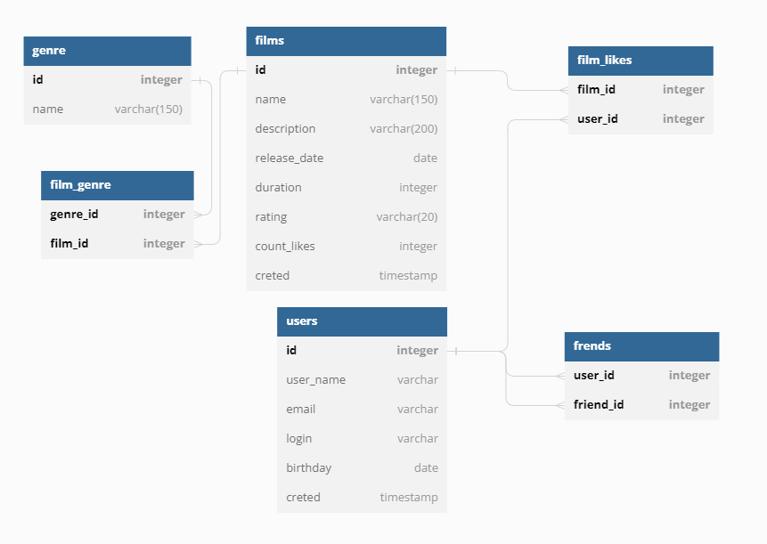

# java-filmorate
Template repository for Filmorate project.
#  схема базы данных

## ***users*** содержит данные о пользователя   
Таблица включает такие поля:  
+ первичный ключ **id** - идентификатор пользователя  
+ **login** - логин пользователя, не должен быть пустым  
+ **email** - электронная почта пользователя, не должна быть пустой  
+ **name** - имя пользователя  
+ **birthday** - дата рождения пользователя  

**Пользователь с id = '?'**  
SELECT id,
email,
login,
name,
CAST(birthday AS date)       
FROM users
WHERE id = '?'

**Список всех пользователей**  
SELECT id,
email,
login,
name,
CAST(birthday AS date)       
FROM users

## ***friends*** содержит данные друзьях пользователях   
Таблица включает такие поля:  
+ **user_id** - id пользователя  
+ **friend_id** - id другого пользователя  

**Список друзей пользователя**  
SELECT friend_id,       
FROM friends
WHERE user_id = '?'

## ***films*** содержит данные о фильмах  
Таблица включает такие поля:  
+ первичный ключ **id** - идентификатор фильма  
+ **name** - название фильма  
+ **description** - описание фильма  
+ **releaseDate** - дата релиза  
+ **duration** - продолжительность фильма  
+ **rating** - рейтинг Ассоциации кинокомпаний  
+ **count_likes** - количество лайков у фильма  

**список фильмов отсортированный по количеству лайков**  
SELECT id,
name,
description,
CAST(releaseDate AS date),
duration,
rating,
count_likes       
FROM films
ORDER BY count_likes

## ***genre*** содержит список жанров  
+ первичный ключ **id** - жанр   
+ **name** - название жанр   

## ***film_genre*** содержит данные о жанре фильмов  
Таблица включает такие поля:  
+ **genre_id** - идентификатор жанра  
+ **film_id** - идентификатор фильма  

 **Список жанров фильма film_id = '?'**  
SELECT d.name,     
FROM film_genre AS fg  
INNER JOIN genre AS g ON fg.genre_id = g.id  
WHERE fg.film_id = '?'
